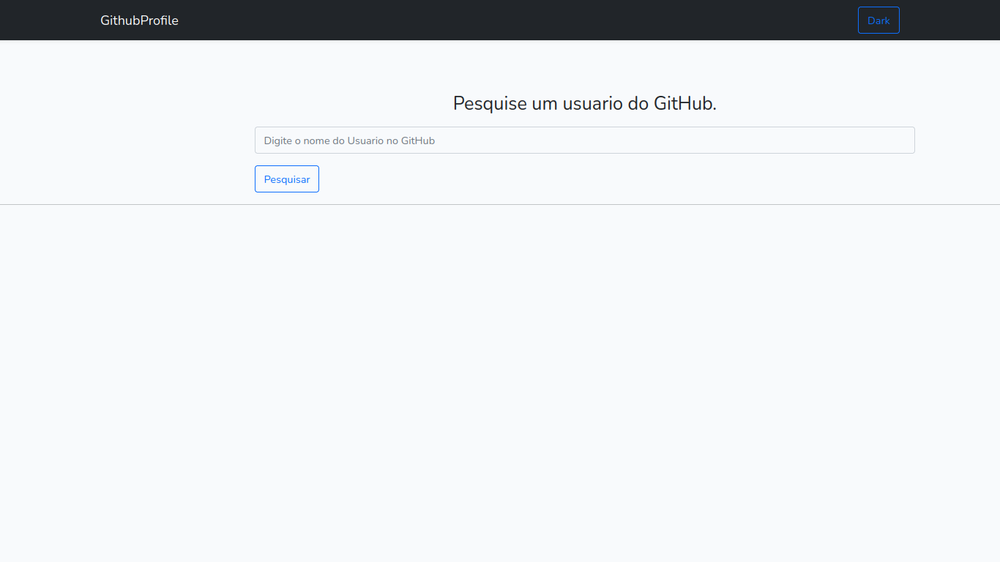

# GithubProfile

Aplicação feita com :
- Laravel 8x
- Vue 2
- Axios

Ela Busca perfis do GitHub usando a APi do Github,usando o Laravel,Vuejs,e colocando ele a rodar no Heroku.
 
 ## Screnshot

 

 

O modo Dark foi feito com Vuejs
 
